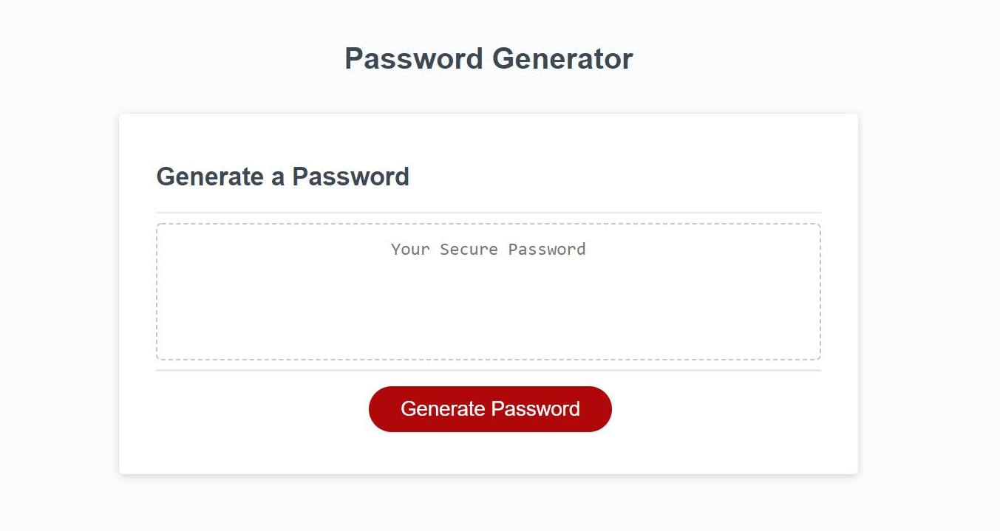

# Password-Generator

## Description

Password application helps to generate strong password with (min 8 - max 128 ) charcters with choosing password criteria consist of:
  * lower case letters.
  * higher case letters.
  * numbers.
  * special charcters.

## Application Use
  * Go to **URL:** https://riheelh.github.io/Password-Generator/
  * Click on Generate Password button.
  * Enter the number character within the range of 8-128 chars.
  * Select the characters types on prompts.
  
